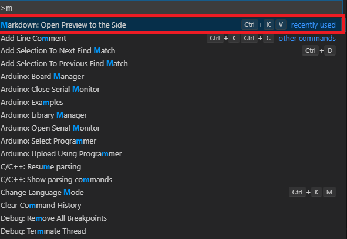

# 開發工具

## HackMD

### 網址:[https://hackmd.io/](https://hackmd.io/)

### 範例:



## VSCode

### **安裝網址:**[**https://code.visualstudio.com/**](https://code.visualstudio.com/)\*\*\*\*

### Markdown外掛:

1. Markdown All in One
2. Markdown PDF

### HTML外掛:

1. Live HTML Previewer
2. HTML CSS Support

## 預覽

### MD:

### HTML:

